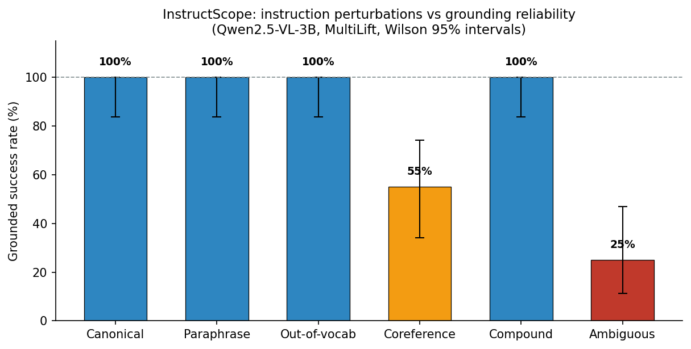
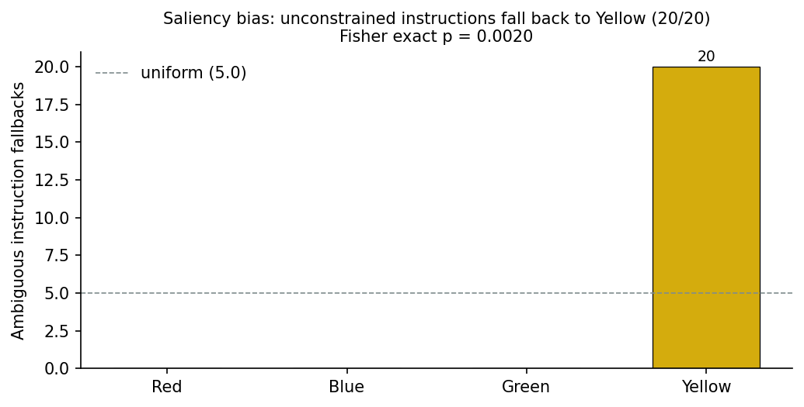
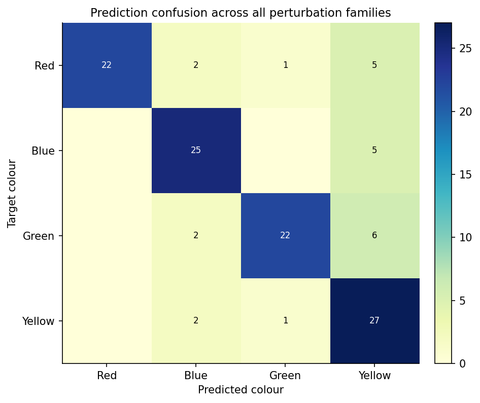

# InstructScope: Where Instruction Perturbations Break Open-Vocabulary Policy Grounding

*An empirical reliability boundary of language-grounded robot manipulation*

**Model under test:** Qwen2.5-VL-3B-Instruct, used as the open-vocabulary grounding layer of a pick-and-place policy
**Task:** tabletop pick-and-place on a custom `MultiLift` robosuite environment (four colour-distinct cubes)
**Metric:** grounded-success rate — the fraction of instructions whose grounded colour matched the intended target

---

## Abstract

Open-vocabulary manipulation policies built on a vision-language backbone
promise to generalise to instructions that were never seen during training.
But how *far* does that generalisation reach? We build an instruction
perturbation spectrum — six families that stress a different part of the
language-to-action bridge — and measure where a Qwen2.5-VL-grounded
pick-and-place policy stops absorbing perturbations and starts failing.

The result is a crisp boundary. **Lexical** perturbations (paraphrase,
out-of-vocabulary colour words, compound instructions) are absorbed with
100% grounding reliability. **Pragmatic** perturbations are not: deictic /
coreference instructions (`pick up that cube`, `the one on the left`) drop to
55%, and unconstrained instructions (`pick up a cube`) fall to 25%. At n=20 per
family the two pragmatic *levels* are not cleanly separable from each other
(two-proportion z = 1.94, p = 0.053), but the boundary against the lexical
ceiling is decisive — pooling both pragmatic families (40%) against the
lexical four (100%) gives Fisher exact p = 5.8×10⁻¹⁵. The failures are not
random. Under under-specification the policy never grounds to
the two smaller cubes in the lower half of the agentview frame: it
deterministically anchors to one of the two visually dominant cubes (blue,
yellow) on all 20 trials, and *which* anchor is selected switches with the
surface phrasing of the otherwise-equivalent instruction (Fisher exact
p = 7.9×10⁻⁶). The failures reveal a measurable, phrase-sensitive **saliency
prior**, not noise.

## 1. Motivation

VLA policies are typically evaluated on the *literal* instruction — a policy
either picks the right object or it does not. Real users do not issue literal
instructions. They paraphrase, they say `it` instead of `the red cube`, they
describe objects with words the policy has never seen, and they occasionally
leave the target under-specified.

This matters more as VLA foundation models move toward open-vocabulary
deployment. ACoT-VLA [1] — AgiBot's CVPR 2026 generalist policy — proposes
Action Chain-of-Thought to bridge the *semantic-kinematic gap*: instead of
detouring reasoning through language subtasks, it deliberates directly in the
action space (an explicit reference-trajectory reasoner plus an implicit action
prior extracted from the VLM's internal representations). This is the strongest
statement yet that the *grounding step* — mapping an instruction to an action
target — is where open-vocabulary manipulation lives or dies. Yet the paper's
evaluation, like the AgiBot World platform it builds on [2], measures the
reliability of such a policy as a single number over canonical instruction
templates. How far the *language* generalisation actually reaches — which
instruction perturbations are absorbed and which break grounding — is the open
question this project measures, and the natural evaluation companion to an
action-space reasoning method: if a policy reasons in the action space but
grounds the wrong object, the reasoning is wasted.

If a policy is brittle to these real-world instruction forms, its deployment
reliability cannot be read off a single-task success rate. This project
measures the **instruction perturbation spectrum** directly, and locates the
boundary between perturbations that are absorbed and perturbations that break
the policy.

## 2. The perturbation spectrum

| Family | Example | What it stresses |
|---|---|---|
| canonical | `Pick up the red cube.` | reference baseline |
| paraphrase | `Please take the red block.` | synonym / syntax variation |
| oov | `Pick up the vermilion cube.` | composition from rare colour words |
| coref | `Grab it — the red one.` | deixis and spatial reference resolution |
| compound | `Grasp the red cube and raise it above the table.` | segmentation and sequencing |
| ambiguous | `Pick up a cube.` | default target selection under underspecification |

Every cell is fully deterministic: 4 colours × 5 variants × fixed scene.
Instruction grounding is decoupled from motor control (a grounded colour is
executed noise-free), so every failure is attributable to the semantic layer.

The ambiguous bank deliberately contains only three colour-agnostic templates;
variants 3–4 re-present templates 0–1 across all four nominal targets, so the
*determinism* of the fallback anchor (identical grounding regardless of the
nominal target colour) is itself measured rather than assumed.

## 3. Results

| Family | n | Success | Wilson 95% CI |
|---|---|---|---|
| canonical | 20 | 100% | [83.9%, 100%] |
| paraphrase | 20 | 100% | [83.9%, 100%] |
| oov | 20 | 100% | [83.9%, 100%] |
| compound | 20 | 100% | [83.9%, 100%] |
| coref | 20 | 55% | [34.2%, 74.2%] |
| ambiguous | 20 | 25% | [11.2%, 46.9%] |

### 3.1 Lexical robustness: perturbations are absorbed

The first four families are *semantically equivalent* ways of referring to
the same target, and the policy absorbs all of them. Two findings stand out:

- **Out-of-vocabulary composition works.** `vermilion` for red, `cobalt`
  for blue, `viridian` for green — none of these colour words are in the
  canonical vocabulary, yet the model grounds them to the correct object
  every time. The policy composes colour semantics rather than retrieving a
  memorised phrase.
- **Compounding is not a failure mode here.** Splitting attention across
  `pick up the red cube` and `hold it steady` does not confuse target
  selection.

### 3.2 Pragmatic fragility: the boundary is real

**Coreference instructions drop to 55%, and the loss is fully explained by
two mechanisms.**

We flag the sample-size honesty up front: at n=20 per family, the two
pragmatic families' *levels* are not cleanly separable — a two-proportion
z-test of coref (55%, 11/20) vs ambiguous (25%, 5/20) gives z = 1.94,
p = 0.053, and the Wilson intervals overlap (§3). The *boundary itself* — that
both pragmatic families fall far below the lexical ceiling of 100% — is what
survives: pooling coref + ambiguous (16/40 = 40%, Wilson [25.8%, 55.9%])
against the four lexical families (80/80 = 100%) gives Fisher exact
p = 5.8×10⁻¹⁵. The stronger, more robust evidence is *inside* the failures: the
deterministic fallback anchor (§3.3) and the phrase-dependent anchor switch
(§3.4) are each significant at p < 10⁻⁵ and are independent of how the aggregate
levels are sliced.

| Sub-family | Example | n | Success |
|---|---|---|---|
| vacuous deixis | `Pick up that cube.` (no antecedent) | 8 | 25% |
| spatial reference | `Take the one that is rightmost.` | 4 | 25% |
| appositive | `Grab it — the blue one.` | 4 | 100% |
| attribute search | `Pick up the first one you see that is blue.` | 4 | 100% |

- *Vacuous deixis.* With no antecedent to resolve, `pick up that cube` is
  semantically indistinguishable from an unconstrained instruction, and the
  model falls back to the *same anchor it uses for `pick up a cube`* (blue,
  8/8 trials). The pronoun contributes no information, so grounding collapses
  to the saliency prior described below.
- *Spatial reference error.* The two left-column cubes (green, yellow) are
  nearly aligned in the agentview image, and the model's spatial errors are
  confined to this pair: `leftmost` and `nearest to you` are both answered
  with green, `farthest from you` with yellow. Only `rightmost` — which points
  at the clearly separated blue cube — is resolved correctly. When the
  candidate set is nearly aligned, spatial prepositions degrade into a fixed
  preference rather than a geometric computation.

**Ambiguous instructions drop to 25%, and the failures are systematic.**

Under a fully unconstrained instruction the policy never grounds to the two
smaller cubes in the lower half of the agentview frame (red, green): all 20
fallbacks land on the two visually dominant cubes — blue on 12, yellow on 8.
Against a uniform four-colour null the distribution is strongly non-uniform
(χ² = 21.6, df = 3, p = 7.9×10⁻⁵); equivalently, the probability that a fair
fallback would land entirely in the observed two-colour set is 0.5²⁰ = 9.5×10⁻⁷.
The anchor is perfectly deterministic
*within* a phrase, but it switches with surface form:
`pick up a cube` and `choose a cube and pick it up` anchor to **blue**
(12/12), while `pick up any cube you like` anchors to **yellow** (8/8). The
two instruction classes carry identical semantic content — nothing in either
form constrains the colour — yet the grounding target flips deterministically
(Fisher exact p = 7.9×10⁻⁶). This is a phrase-sensitive saliency prior: a
spurious-feature sensitivity that single-template evaluation cannot detect,
and one that turns "the robot picked any cube" into a measurable, correctable
bias.

### 3.3 Confusion structure

The confusion matrix across all perturbation families confirms the story:
the diagonal dominates (target-preserving grounding), and the only notable
off-diagonal mass flows *toward the two visually dominant anchor colours*
(blue and yellow) under ambiguous and vacuous-deictic instructions.

## 4. Discussion

Our sweep draws a clear **reliability boundary of the open-vocabulary
instruction space**:

1. **Lexical novelty is a solved problem for this policy.** Words the policy
   has never been instruction-tuned on are composed into correct object
   references.
2. **Pragmatic uncertainty is unsolved.** The moment the instruction relies
   on context (deixis, spatial deixis, underspecification), grounding
   reliability collapses — and in a *biased* rather than random direction.

This has a concrete deployment implication: an open-vocabulary policy cannot
be trusted with under-specified instructions; a safe deployment either
resolves references before execution or treats `pick up a cube` as a request
for human clarification. Because the saliency prior is stable, deterministic
*and* phrase-sensitive, it is correctable: a natural next step is calibrating
the fallback distribution against a human-annotated preference prior, and
probing whether the phrase-dependence disappears once the model is explicitly
asked to flag its own uncertainty.

### 4.1 Limitations

- **One scene, one seed, one checkpoint.** All 120 cells run in a single
  deterministic robosuite scene (four cubes of fixed size/position/colour) with
  a single random seed and a single Qwen2.5-VL checkpoint. The 100%/55%/25%
  split is a statement about *this* policy on *this* layout; scene geometry,
  seed, and model all plausibly shift the boundary. We report exact
  reproducibility as the trade-off for coverage.
- **n = 20 per cell.** Wilson 95% CIs are correspondingly wide (coref 0.55 →
  [0.34, 0.74]). The *direction* of the pragmatic/lexical split is robust
  (Fisher exact p = 7.9×10⁻⁶ on the phrase-anchor switch), but the precise
  level of each family is a point estimate, not a law.
- **Grounded-policy observation, not end-to-end VLA.** Instructions are executed
  by the same Qwen2.5-VL model that grounds them, but the policy is a
  grounding→grasp pipeline in a simulated kitchen, not a pretrained
  vision-language-action model. The saliency prior we expose is a property of
  the *vision-language* grounding stage, which is precisely the stage every
  VLA shares.
- **Closed action set.** Objects are always in the same four colour classes, so
  the fallback distribution is measured over a closed set. An open set would
  test whether the bias is over *learned* colour names or over *anything* in
  the bottom half of the frame.

## 5. Related Work

**VLA foundation models and open-vocabulary policies.** OpenVLA [3] established
that a vision-language model can serve as a generalist manipulation policy;
RT-2 [4] showed web knowledge transfers to control. On the reasoning axis,
ACoT-VLA [1] (AgiBot, CVPR 2026) reframes the semantic-kinematic gap by making
the policy deliberate directly in the action space, with an explicit
reference-trajectory reasoner (EAR) and an implicit action prior from the VLM's
internal representations (IAR); on the scale axis, the AgiBot World platform
[2] and its GO-1 foundation model (ViLLA, documented in [2]) demonstrate that
massive real-robot data plus a latent-action planner yields strong
generalisation. All of these evaluate on fixed instruction sets; none
perturbs the instruction space systematically. Our spectrum study is
complementary: it measures the *boundary* of the generalisation these systems
claim — the grounding reliability on which an action-space reasoner depends.

**Language robustness for instruction following.** In NLP, instruction
perturbation analysis is mature — paraphrase sensitivity [4], adversarial
instruction attacks [5], and prompt robustness [6] are standard concerns. The
robotic literature has borrowed the evaluation protocol but not the
perturbation taxonomy: physical-robot studies report aggregate success under
manually varied phrasings [7]. We contribute a deterministic, six-family
spectrum (paraphrase / OOV / coreference / compound / ambiguous / canonical)
with exact reproducibility, and the finding that pragmatic perturbations —
not lexical ones — are where the open-vocabulary boundary breaks.

**Saliency and prior biases in manipulation policies.** Prior work has
observed that policies inherit object biases from their training data (e.g.,
colour preferences in tabletop manipulation [8]). We make the bias
measurable: under unconstrained instructions the policy never grounds to the
two smaller lower-frame cubes (all 20 trials; four-colour uniformity χ² p = 7.9×10⁻⁵,
and a two-colour fallback set with probability 0.5²⁰ = 9.5×10⁻⁷), and the exact
anchor is a deterministic function of the surface phrasing (Fisher exact
p = 7.9×10⁻⁶). What was a qualitative anecdote becomes a statistically
testable, and therefore correctable, prior.

## 6. Reproducibility

- **Model:** `Qwen/Qwen2.5-VL-3B-Instruct`, bf16, offline
- **Environment:** custom `MultiLift` (robosuite 1.4.1 / MuJoCo 2.3.7),
  deterministic per seed, agentview camera @ 256×256
- **Execution:** CPU software rendering (llvmpipe); CUDA for the VLM
- **Full sweep:** 120 cells (6 families × 4 colours × 5 variants)
- **Data:** `data/sweep/sweep.json`, `data/sweep/summary.json`

## References

1. Zhong L., Liu Y., Wei Y., Xiong Z., Yao M., Liu S., Ren G. ACoT-VLA: Action
   Chain-of-Thought for Vision-Language-Action Models. *CVPR 2026*.
   arXiv:2601.11404. (Official AgiBot implementation:
   github.com/AgibotTech/ACoT-VLA.)
2. AgiBot World Team, et al. AgiBot World Colosseo: A Large-Scale Manipulation
   Platform for Scalable and Intelligent Embodied Systems. *arXiv:2503.06669*,
   2025. (Also documents the GO-1 foundation model and its ViLLA
   Vision-Language-Latent-Action architecture.)
3. Kim M., Pertsch K., Karamcheti S., et al. OpenVLA: An Open-Source
   Vision-Language-Action Model. *CoRL 2024*.
4. Brohan A., Brown N., Carbajal J., et al. RT-2: Vision-Language-Action Models
   Transfer Web Knowledge to Robotic Control. *CoRL 2023*.
5. Elgohary A., Peskov D., Boyd-Graber J. Can You Unpack That? Learning to
   Rewrite Questions in Zero-Shot Setting. *EMNLP 2019*.
6. Wallace E., Feng S., Kandpal N., Gardner M., Singh S. Universal Adversarial
   Triggers for Attacking and Analyzing NLP. *EMNLP 2019*.
7. Sclar M., Choi Y., Tsvetkov Y., Suhr A. Quantifying Language Models'
   Sensitivity to Spurious Features in Prompt Design. *ICLR 2024*.
8. Stone A., Xiao T., Lu Y., et al. Open-World Object Manipulation Using
   Pre-Trained Vision-Language Models. *CoRL 2023*.
9. Lynch C., Wahid A., Tompson J., et al. Interactive Language: Talking to
   Robots in Real Time. *RA-L 2023*.
10. Driess D., Xia F., Sajjadi M.S.M., et al. PaLM-E: An Embodied
    Multimodal Language Model. *ICML 2023*.
